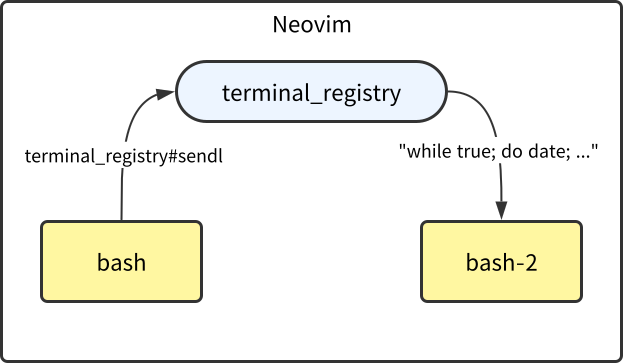

```
==================================================================================================
| それでも Neovim と生きていきたいから、エージェントが Neovim のターミナルを操作できるようにした |
==================================================================================================

          2026-09-08 みんなの「もう戻れない」ターミナル環境LT会〜開発効率化の工夫を大公開〜

                                                                                        山本悠滋
```

------------------------------------------------------------------------------

# はじめまして！ 👋😄

- [山本悠滋](https://github.com/igrep)
- 音ゲーとプリキュアとポムポムプリンが大好き
- 趣味ではTypeScriptで自作言語を作ったり、
- 仕事では[MagicPod](https://magicpod.com/)というアプリケーションを開発したりしています。

------------------------------------------------------------------------------

# 今日話すこと

- Neovim のターミナルをちょっと便利にするプラグインを作って使っていた
    - [nvim-terminal-registry](https://github.com/igrep/nvim-terminal-registry/)
- CLI ラッパーを提供すれば AI エージェントがターミナルを操作できるじゃん、と気付いた
- 🙇 まだ AI エージェントに使わせる所まで試せてません！
    - skill を作らなきゃ

------------------------------------------------------------------------------

# ⚠️おことわり

- 自分は世間のみなさんほど AI agent を使いこなせておりません
- なまじ Neovim の操作に慣れているためか、小さな変更は手でやることも多い

------------------------------------------------------------------------------

# 私の毎日の開発の始まり (1)

`nvim -c "source .project.vim"` でプロジェクト毎の Vim script を読んで Neovim を起動

👇大まかにこんな感じ

```vim
" 開発用サーバー。プロジェクト内のファイルの変更を監視して自動でビルドする
call terminal_registry#start("pnpm run dev", { "id": "server" })

" 自動テスト。プロジェクト内のファイルの変更を監視して自動でテストを実行する
call terminal_registry#start("pnpm run test", { "id": "test" })

" Git の操作など諸々を行うためのシェル
call terminal_registry#start("bash")

" そしてやっぱり AI エージェント
call terminal_registry#start("claude")

" ... その他、プロジェクトで最近開いたファイルをいくつか開くコマンドなど ...
```

------------------------------------------------------------------------------

# 私の毎日の開発の始まり (2)

`terminal_registry#start`関数:

- 指定したコマンドでターミナルを起動、名前を割り当てる

```vim
call terminal_registry#start("pnpm run dev", { "id": "server" })
"                                              ^^^^^^^^^^^^^^
"                                             ここで名前を指定
```

- `id`を指定しない場合は、コマンド名がそのまま名前になる

```vim
call terminal_registry#start("bash")
"                            ^^^^^^
"                      この場合は "bash" が名前になる
```

------------------------------------------------------------------------------

# 私の毎日の開発の始まり (3)

名前を割り当てた後:

```vim
" バッファーを切り替えたり、
call terminal_registry#switch("server")

" 入力を送ったりできる
call terminal_registry#sendl("bash", "echo hello")
```

実際には👆のコマンド呼び出しにショートカットキーを割り当てて使うことが多い

------------------------------------------------------------------------------

# 💥問題発生

- 昨今のような AI が普及する以前に terminal_registry を作り、  
  前述のフローで開発する習慣が身についてから、時は流れた
-  `claude` を使う際、次の問題が:

Claude: `pnpm run build` します  
私: いや裏で `pnpm run dev` してるからビルドは不要だよ

- またある日:

私: サーバーがこんなエラーを出したよ
Claude: どれどれ...
私: .o(いちいち貼り付けるのめんどいなぁ)

------------------------------------------------------------------------------

# 💡対応

- `terminal_registry` で起動したプロセスから情報を取り出すコマンドを作れば、
- **AI エージェントからも**使えるはず！

------------------------------------------------------------------------------

# 論より証拠！



✍デモで使うコマンド:

```vim
" これは Vim script なので、Neovim のコマンドラインで入力
call terminal_registry#start("bash")
```

```bash
# 👇これは 👆 で起動したシェルで入力
terminal-registry start bash '{ "id": "bash-2" }'
terminal-registry sendl bash-2 "while true; do date; sleep 1; done"
terminal-registry get_recent_output_lines bash-2 10
```

------------------------------------------------------------------------------

# 今後

- AI エージェントが使いやすいようにスキルを作ろう
- サブエージェントの管理にも使えるか？
- 実戦で試そう
- その他細かい機能追加・修正を！

------------------------------------------------------------------------------

# まとめとおまけ

- Neovim は
    - 組み込みのターミナルに加え、
    - ウィンドウの配置を管理する機能や、
    - 高い拡張性を備えているので、
    - 人間と AI エージェントが協業する環境になれる（はず！）
- これから Neovim を使いたいという方は [Neovim distribution][1] なるものを調べてみるといいかも
    - 私は Vim 時代から続く秘伝のタレがあるので、どれがおすすめとかは言えませんが！


[1]: https://www.google.com/search?q=neovim+distribution

------------------------------------------------------------------------------

